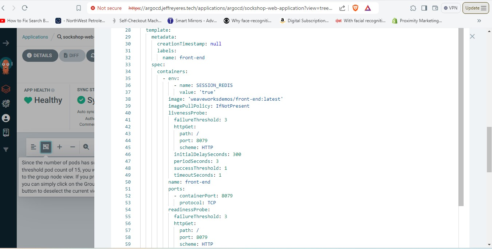

# AltSchool of Cloud Engineering Tinyuka 2023 Capstone Project 

## Objective:

We aim to deploy a microservices-based application, specifically the Socks Shop, using a modern approach that emphasizes automation and efficiency. The goal is to use Infrastructure as Code (IaaC) for rapid and reliable deployment on Kubernetes.

## TOOL USED IN THIS PROJECT
- ArgoCD for deploy application on AWS Elastic Kubernetes Service
- Prometheus for monitoring cluster
- Grafana for visualizing metrics gotten with prometheus
- Github Actions for creating the Elastic Kubernetes Service and installing argocd in the cluster.

## Steps:
In order to deploy the socks app, I ensured that I have an active google cloud account, installed helm(Kubernetes package manager), configured gcloud cli and kubectl. I also installed terraform.

ArgoCD was installed for continuous deployment(CD) on my GCP cluster. 

I also used github actions to automate the setup process, ensuring that the application can be deployed quickly and consistently.

## Architecture Diagram


## Sock-Shop Deployment
1. First run terraform init, then terraform plan and terraform apply on vscode.


2. Connect to your gcp cluster from vscode
````
gcloud container clusters get-credentials <cluster name> --region <gcp region> --project <gcp project id>
````
3. Deploy your app to your gcp cluster using for example the socks yaml file in this repo. Run the following command at the file directory

````
kubectl apply -f .
````

4. Check your running pods using the following command:
````
kubectl get pods -n sock-shop
````


5. Next, using helm, install ingress nginx, prometheus stack and certificate manager. The configuration files in yaml format for alertmanager, cert-manager and ingress-nginx are stored in their separate folder. Apply changes using kubectl apply 

## PROOF OF DEPLOYMENT OF A SECURED APPLICATION


### PROOF OF APP MONITORING AND LOGGING


Prometheus alertmanager was configured to send notifications to slack if for example a pod is down


# ARGOCD 
ArgoCD is a declarative, GitOps continuous delivery tool for Kubernetes. It enables developers to manage and deploy applications on Kubernetes clusters using Git repositories as the source of truth for defining the desired application state. argocd (https://argo-cd.readthedocs.io/en/stable/getting_started/)


### ACCESSING ARGOCD DASHBOARD
The argocd-server had a cluster ip so the service type was changed to a loadbalancer. This was done by:
- running the command `kubectl get all -n argocd`
- editing argocd server: `kubectl edit svc argocd-server -n argocd`
- changing the type to **LoadBalancer or NodePort**
- running `kubectl get svc -n argocd`

To get the password for the argocd run:
`kubectl get secret -n argocd`
This will output
```
NAME                          TYPE     DATA   AGE
argocd-initial-admin-secret   Opaque   1      56m
argocd-notifications-secret   Opaque   0      56m
argocd-secret                 Opaque   5      56m

```
To get the initial admin secret run:
`kubectl get secret argocd-initial-admin-secret -o yaml -n argocd`. This will output the information in a yaml format
NOTE: You can also decide to get the output in a json format.

```
apiVersion: v1
data:
  password: bmdYSk9WN0Z3d2pEQkVTWQ==
kind: Secret
metadata:
  creationTimestamp: "2024-03-06T11:06:21Z"
  name: argocd-initial-admin-secret
  namespace: argocd
  resourceVersion: "1584"
  uid: 36f81d61-9db6-406b-95b0-ee16deb61236
type: Opaque

```
To decrypt the password run:
`echo "bmdYSk9WN0Z3d2pEQkVTWQ==" | openssl base64 -d ; echo`
Password = ngXJOV7FwwjDBESY


## ArgoCD Deployments


I was able to quickly deploy different versions of the socks-shop frontend application using argocd. This was done by simply updating the image version of the frontend app in the sock-shop deployment yaml file and pushing to github. ArgoCD automatically syncs with update by pulling the new image from dockerhub and deploying the new app.

Frontend deployment with red buttons


Frontend deployment with the latest image



### PROOF OF SOCK-SHOP APP DEPLOYMENT USING GITHUB ACTIONS

For the github actions deployment, I used github actions input to deploy the app. The app is deployed if input "apply" is selected after pushing the changes to your code on github. When input "destroy" is selected, all the the resources on gcp is destroyed using terraform destroy. The details of the github actions workflow can be found on the .github folder of this repo.


